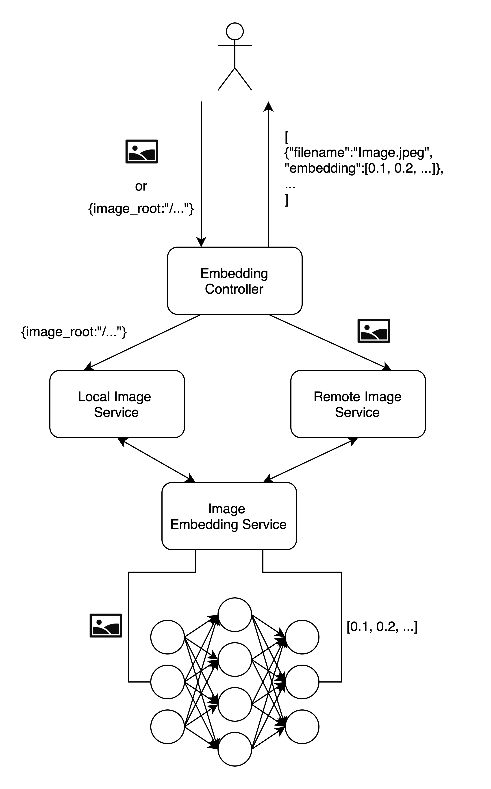

# BUBE Image Duplicate Detection

[](https://github.com/coc-ArtificialIntelligence/bube/blob/main/README.md)

Complex duplicate detection of images through the use of Deep Learning.

BUBE Image Duplicate Detection is a software that can be used to compare images on any platform in compliance with data protection regulations and without violating image copyrights.
BUBE Image Duplicate Detection consists of two parts: the vectorization algorithm and the actual comparison. 
These two components originally come from the image forensics software toolbox called BUBE (Bildforensik Und BetrugsErkennung) developed by [NÜRNBERGER Versicherung](https://www.nuernberger.de). 
The main developer there is Dr. Peter Patlevic, in collaboration with partners from the Friedrich-Alexander-University Erlangen ([FAU Chair of IT Security Infrastructures](https://www.cs1.tf.fau.de)). 
Wolfgang Färber and Bruno Unberath also contributed.

## Brief description
A ResNet50 is used to "vectorize" images. 
By that, we mean the conversion of an image into a numerical vector, specifically into 2,048 floating-point numbers. 
BUBE Image Duplicate Detection can calculate the proximity of such vectors, determining the similarity between two images ranging from "identical" to "not at all". 
The used method can recognize identical content or scenes, even if the images have been cropped, mirrored, zoomed, or undergone slight perspective changes or color/grayscale transformations. 
The intention is to approximate the result to human vision.
The images cannot be reconstructed from the vectors themselves. 
This was demonstrated through a challenge project at FAU. Therefore, the vectors do not violate data protection and the right to the image copyrights.

## Motivation
BUBE Image Duplicate Detection is the component currently (2024/2025) used in the Proof of Concept Image Forensics on the HIS platform (Hinweis- und Informationssystem) by the General Gesamtverband der Versicherer ([GDV](https://www.gdv.de/gdv-en)). 
For a successful image comparison, it is crucial that all participants use the same vectorization method. 
To lower the barrier for participating in cross-company image comparison as much as possible, the vectorization algorithm is provided to the market for free. 
Interested parties can integrate it into their own IT landscape. 
The internally generated vectors can then be exchanged.
Of course, other application scenarios for BUBE Image Duplicate Detection are also conceivable.


## Content of the repo
This repo contains the implementation of duplicate detection and can be executed in two different variants:

* **Embedding System**: Here, the functionality of the embedding is provided by a Neural Network. Images can be sent to
  the system via a REST API to obtain the embeddings.
* **FEEX Application**: The functionality of the embeddings is extended by duplicate detection and the calculation of
  duplicate probability. For this purpose, embeddings are stored in a Vector database.

## Run the app (Python)

To start the application, the requirements can be installed via `pip`.

### Requirements

The dependencies of the application were managed using `Poetry`. However, conventional use through `pip` is also
possible.

The creation of a virtual environment is recommended.

On Linux/MacOS:

```bash
python3 -m venv venv
source venv/bin/activate
```

On Windows (Powershell):

```bash
python3 -m venv venv
.\venv\Scripts\activate
```

The installation of dependencies (regardless of the operating system) by:

```bash
pip install .
```

### Windows

On Windows, the C++ Build Tools are required to install the dependencies.
These can be installed with the following
link: [C++ Build Tools](https://visualstudio.microsoft.com/de/visual-cpp-build-tools/).
The needed Build Tools are currently (depending on the Windows Version used):

* MSVC v143 - VS 2019 C++ x64/x86 build tools
* Windows 11 SDK (10.0....)
  The recommended way is to run the app in a Docker container.

### Using a GPU (NVIDIA)

If you have an NVIDIA GPU, you need to have CUDA and cuDNN installed.  
The project was tested with an NVIDIA RTX 4090 with the following versions:

* CUDA 12.4
* cuDNN 9.4

Afterward install dependency with:

```bash
pip install onnxruntime-gpu
```

This dependency is not included in the pyproject.toml, because installation can fail if requirements aren't met.

Depending on the available memory, the batch size should be adjusted.
The recommended batch size is 4.
An NVIDIA RTX 4090 with 24GB of memory, uses nearly all memory with a batch size of 4 images with a resolution of
4032x3024.
This corresponds to 12 megapixels in full size (which is more than 4K resolution).

### Run the app (Docker)

```bash
docker build -t bube .
docker run -p 8000:8000 bube
```

### Start the app

The application can then be started with the following command:

```bash
python -m bube
```

This starts the application on `localhost:8000`. The OpenAPI documentation can be viewed at `localhost:8000/docs`.

### Run the tests

The tests are localted in the `tests` folder.
To run the tests, the following command can be used:

```bash
python -m pytest
```

## Configs

Configurations can be adjusted in the file `bube/config/config.py`. However, the recommended configuration is to set via
environment variables.

The parameter `BUBE_MODE` determines whether the system is run as an Embedding System or as a FEEX Application.

```bash
BUBE_MODE = "embedding" | "app"
```

If the application is to be run as a FEEX Application, the database must be configured. There are two possibilities for
this:

* **ChromaDB**: A simple embedded database that stores files in a local file (as a .sqlite3 file)
* **Postgres with pgVector**: A Postgres database that can store vectors through the pgVector extension.

By default, an embedded ChromaDB is used, which makes the application runnable without external systems.

```bash
DB_TYPE = "chroma" | "pgvector"

# ChromaDB Setting -> embedded is recommended
CHROMA_DB_MODE = "embedded" | "http"
CHROMA_DB_EMBEDDED_PATH = "./data/chroma_db/"
# ChromaDB HTTP Setting are only required if CHROMA_DB_MODE is set to "http"
CHROMA_DB_HTTP_HOST = "localhost"
CHROMA_DB_HTTP_PORT = 8000
CHROMA_DB_HTTP_SSL = True
CHROMA_DB_DATABASE_NAME = "img_embeddings"

# Postgres Setting
PGVECTOR_DB_HOST = "localhost"
PGVECTOR_DB_PORT = 5432
PGVECTOR_DB_USER = "postgres"
PGVECTOR_DB_PWD = "password"
PGVECTOR_DB_HTTP_SSL = False
PGVECTOR_DB_DATABASE_NAME = "postgres"
PGVECTOR_DB_TABLE_NAME = "feex_embeddings"
```

The application will run on `localhost:8000` by default. This can be changed with the following env vars:

```bash
BUBE_APP_HOST = "0.0.0.0"
BUBE_APP_PORT = 8000
```

The GPU usage is active by default. It can be changes with the following env vars:

```bash
USE_GPU = True | False
LOCAL_IMAGE_BATCH_SIZE = 4
```

## Architecture

The application provides several REST interfaces to process images. If the application is started with the
config `BUBE_MODE = "embedding"`, only the Embedding System is provided. With the config `BUBE_MODE = "app"`, in
addition to the Embedding System, duplicate detection and storage using a Vector database are also provided.

### Architecture of Embedding System



The Embedding System consists of a controller that provides the REST interfaces. Images can be passed directly to this,
or a local path to a directory with images. If images are passed directly, the `Remote Image Service` handles the
processing of the images. For local paths, the `Local Image Service` handles reading the images. Both services use
the `Image Embedding Service` to calculate the embeddings. This contains the Neural Network used to calculate the
embeddings.

### Architecture of FEEX Application


The FEEX Application extends the Embedding System with duplicate detection and storage in a Vector database. The
embeddings are calculated as in the Embedding System. However, instead of returning the embedding, it is then forwarded
to the corresponding database. Here, the 'nearest' embeddings and the corresponding metadata are returned. The 'nearest'
embeddings are very similar (suspicious) images or even nearly identical (duplicate) images. The `FEEX Service` converts
the 'nearest' embeddings into a so-called `DuplicateReport`. This is a data type that contains duplicates and suspicious
images. This data type is returned to the user.

## API

When the application is started, the OpenAPI documentation can be viewed at `localhost:8000/docs`. Additionally, the
Jupyter Notebook `Example.ipynb` contains examples of how the API can be used with Python.

### Embeddings Controller

The Embeddings Controller provides the following two endpoints:

* **GET /embeddings/local**: Calculates the embeddings of locally stored images
* **POST /embeddings**: Calculates the embeddings of transmitted images

The endpoint `GET /embeddings/local` accepts two query parameters:

* `image_root`, required: String, with the folder of images on the system of the application
* `filenames`, optional: Array of strings with the names of the images from the `image_root` folder. If not specified,
  all images in the `image_root` folder are used.

An example request with `curl`, which reads the images __image1.jpg__ and __image2.jpg__ from the folder _
_/Users/cool_nickname/Images__ (folder on the system of the application), looks like this:

```bash
curl -X 'GET' \
  'http://localhost:8000/embeddings/local?image_root=%2FUsers%2Fcool_nickname%2FImages&filenames=image1.jpg&filenames=image2.jpg' \
  -H 'accept: application/json'
```

The endpoint `POST /embeddings` accepts the transmission of images as `multipart/form-data`. The reason why it is a POST
request is the transmission of images. The transmission of the images can be done with `curl` using the `-F` flag. To
send the images __image1.jpg__ and __image2.jpg__ from the folder __/Users/cool_nickname/Images__ (folder on the system
of the client), it looks like this:

```bash
curl -X 'POST' \
  'http://localhost:8000/embeddings' \
  -H 'accept: application/json' \
  -H 'Content-Type: multipart/form-data' \
  -F 'images=@/Users/cool_nickname/Images/image1.jpg;type=image/jpeg' \
  -F 'images=@/Users/cool_nickname/Images/image2.jpg;type=image/jpeg'
```

Both endpoints return an array with the filename and the embedding. This looks like this:

```json
[
  {
    "filename": "/Users/cool_nickname/Images/image1.jpg",
    "embedding": [
      0.009263942018151283,
      ...
      0.010558908805251122
    ]
  },
  {
    "filename": "/Users/cool_nickname/Images/image2.jpg",
    "embedding": [
      0.017552191391587257,
      ...
      0.018384460359811783
    ]
  }
]
```

### FEEX Controller

The FEEX Controller provides the following endpoints:

* **POST /feex/insert**: Inserts embeddings into the Vector database
* **POST /feex**: Searches for duplicates and similar images in the Vector database  
  Both endpoints are POST requests, as images can be uploaded in each case.

The endpoint `POST /feex/insert` only stores the embeddings in the database. This is useful, for example, to enable an
initial population of the data set.

The endpoint `POST /feex` searches for duplicates and similar images in the Vector database.

Both endpoints accept the transmission of images as `multipart/form-data`. Alternatively, local images can also be read.
The endpoint `POST /feex` additionally accepts a query parameter `save_embeddings`. By default, this parameter is set to
true, which means that the embeddings are stored in the database after the duplicate search for future searches. If this
is not desired, the parameter can be set to false.

An example request with `curl`, which transmits images directly, looks like this:

```bash
curl -X 'POST' \
  'http://localhost:8000/feex' \
  -H 'accept: application/json' \
  -H 'Content-Type: multipart/form-data' \
  -F 'images=@/Users/cool_nickname/Images/image1.jpg;type=image/jpeg' \
  -F 'images=@/Users/cool_nickname/Images/image2.jpg;type=image/jpeg'
  #Optional: -F 'save_embeddings=true'
```

An example request with `curl`, which reads images from a folder on the system of the application, looks like this:

```bash
curl -X 'POST' \
  'http://localhost:8000/feex' \
  -H 'accept: application/json' \
  -H 'Content-Type: multipart/form-data' \
  -F 'image_root=Users/cool_nickname/Images/' \
  -F 'filenames=image1.jpg' \
  -F 'filenames=image2.jpg'
```

The endpoint `POST /feex/insert` returns an HTTP status code 201 on success without a body.  
The endpoint `POST /feex` returns a `DuplicateReport`. This looks like this:

```json
[
  {
    "original_filename": "Users/cool_nickname/Images/image1.jpg",
    "duplicates": {
      "num_of_files": 2,
      "filenames": [
        {
          "filename": "copied_image1.jpg",
          "distance": 0,
          "duplicate_chance_in_percent": 100
        },
        {
          "filename": "slightly_modified_image1.jpg",
          "distance": 0.0511707437218693,
          "duplicate_chance_in_percent": 94
        }
      ]
    },
    "suspicious": {
      "num_of_files": 1,
      "filenames": [
        {
          "filename": "more_modified_image1.jpg",
          "distance": 0.3634707437218693,
          "duplicate_chance_in_percent": 63
        }
      ]
    }
  }
]
```

## Bibliography

- Wang und S. Jiang, „INSTRE: A New Benchmark for Instance-Level Object Retrieval and Recognition," ACM Trans.
  Multimedia Comput. Commun. Appl., Bd. 11, pp. 37:1--37:21, 2 2015.
- K. He, X. Zhang, S. Ren und J. Sun, „Deep Residual Learning for Image Recognition," in 2016 IEEE Conference on
  Computer Vision and Pattern Recognition (CVPR), 2016.
- G. Tolias, R. Sicre und H. Jégou, „Particular object retrieval with integral max-pooling of CNN activations," 2016.
