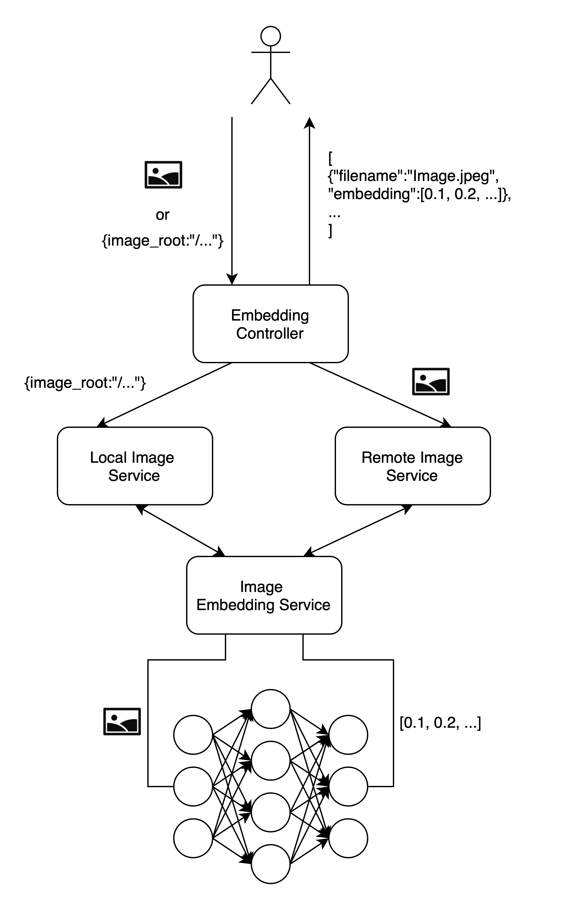
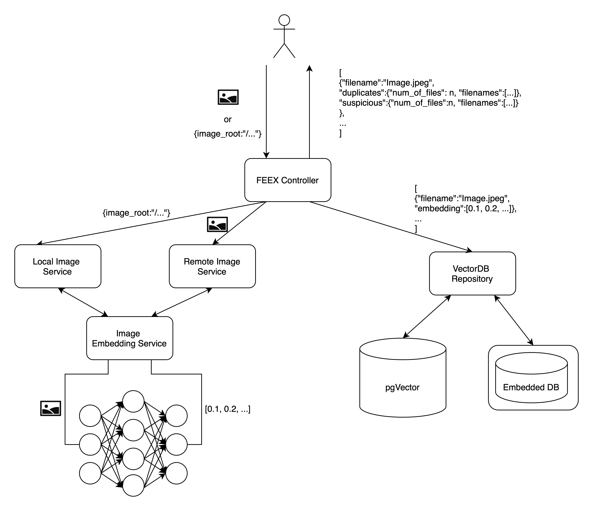

# BUBE Image Duplicate Detection

[](https://github.com/codecampn/bube-image-duplicate-detection/blob/main/README.en.md)

Komplexe Duplikatserkennung von Bildern durch den Einsatz von Deep Learning.

BUBE Image Duplicate Detection ist eine Software mit der Bilder Datenschutz-konform und ohne Verletzung des Rechts am Bild auf einer
beliebigen Plattform verglichen werden können.
BUBE Image Duplicate Detection besteht aus zwei Teilen: dem Vektorisierungsalgorithmus und dem eigentlichen Vergleich. Die zwei Komponenten stammen
ursprünglich aus der Toolbox der Bildforensik-Software BUBE der [NÜRNBERGER Versicherung](https://www.nuernberger.de) (Bildforensik Und
BetrugsErkennung). Hauptentwickler ist dort Dr. Peter Patlevic, zusammen mit Partnern von der
Friedrich-Alexander-Universität Erlangen ([FAU Lehrstuhl IT-Sicherheitsinfrastrukturen](https://www.cs1.tf.fau.de)). Außerdem haben Wolfgang Färber
und Bruno Unberath mitgewirkt.

## Kurzbeschreibung
Ein ResNet50 wird verwendet, um Bilder zu „vektorisieren“. Darunter verstehen wir die Umwandlung eines Bildes in einen Zahlenvektor, konkret in 2.048 Float-Zahlen.
BUBE Image Duplicate Detection kann die Nähe solcher Vektoren berechnen. Die Ähnlichkeit zweier Bilder, abgestuft zwischen „identisch“ und „gar nicht“ wird damit bestimmt.
Das verwendete Verfahren kann gleichen Inhalt, bzw. gleiche Szenen erkennen, auch wenn die Bilder beschnitten, gespiegelt oder gezoomt wurden, leichter Perspektivwechsel oder Umwandlung farbig/grau-Töne stattgefunden hat. 
Das Ergebnis nähert sich in der Absicht dem menschlichen Sehen.
Die Bilder können aus den Vektoren nicht zurückgerechnet werden. Dieses wurde durch ein Challenge-Projekt an der FAU nachgewiesen. Die Vektoren selber verstoßen also nicht gegen Datenschutz und Recht am Bild.

## Motivation
Bei BUBE Image Duplicate Detection  handelt es sich um die Komponente, die aktuell (2024/2025) auch im Proof of Concept Bildforensik auf der HIS-Plattform (Hinweis- und Informationssystem) beim Gesamtverband der Versicherer ([GDV](https://www.gdv.de)) verwendet wird. 
Voraussetzung für einen gemeinsamen Bildvergleich ist, dass alle Teilnehmer das gleiche Vektorisierungsverfahren verwenden. 
Um die Schwelle zur Teilnahme an einem Unternehmensübergreifenden Bildvergleich so niedrig wie möglich zu halten, wird der Vektorisierungs-Algorithmus dem Markt hier kostenlos zur Verfügung gestellt. 
Er kann von Interessierten in die eigene IT-Landschaft integriert werden. 
Die intern erzeugten Vektoren können dann ausgetauscht werden.
Es sind natürlich auch andere Anwendungsszenarien für BUBE Image Duplicate Detection denkbar.

## Inhalt des Repos

Dieses Repo enthält die Implementierung der Duplikatserkennung und kann in zwei unterschiedlichen Varianten ausgeführt
werden:

* **Embedding System**: Hierbei wird die Funktionalität des Embeddings durch ein Neuronales Netz bereitgestellt.
  Bilder können über eine REST API an das System gesendet werden, um die Embeddings zu erhalten.
* **FEEX Application**: Die Funktionalität der Embeddings wird erweitert durch die Duplikatserkennung und die Berechnung
  der Duplikatswahrscheinlichkeit.
  Hierzu werden Embeddings in eine Vector Datenbank gespeichert.

## Run the app (Python)

Um die Anwendung zu starten, können die Requirements über `pip` installiert werden.

### Requirements

Die Abhängigkeiten der Anwendung wurden mittels `Poetry` verwaltet.
Jedoch ist auch eine gewöhnliche Nutzung durch `pip` möglich.

Empfohlen wird die Erstellung eines virtuellen Environments.

Unter Linux/MacOS:

```bash
python3 -m venv venv
source venv/bin/activate
```

Unter Windows (Powershell):

```bash
python3 -m venv venv
.\venv\Scripts\activate
```

Die Intstallation der Abhängigkeiten (unabhängig des Betriebssystems) durch:

```bash
pip install .
```

### Windows

Um die Abhängigkeiten auf Windows zu installieren, werden die C++ Build Tools benötigt.
Diese können mit folgendem Link installiert
werden: [C++ Build Tools](https://visualstudio.microsoft.com/de/visual-cpp-build-tools/).
Abhangig von der Windows Version, können folgende Tools benötigt werden:

* MSVC v143 - VS 2019 C++ x64/x86 build tools
* Windows 11 SDK (10.0....)
  Es wird deshalb empfohlen, die Anwendung über Docker zu starten.

### Nutzung einer GPU (NVIDIA)

Wenn Sie eine NVIDIA-GPU haben, müssen Sie CUDA und cuDNN installiert haben.
Das Projekt wurde mit einer NVIDIA RTX 4090 mit den folgenden Versionen getestet:

* CUDA 12.4
* cuDNN 9.4

Installieren Sie anschließend folgende Abhängigkeit:

```bash
pip install onnxruntime-gpu
```

Diese Abhängigkeit ist nicht in der pyproject.toml enthalten, da die Installation fehlschlagen kann, wenn die
Anforderungen nicht erfüllt sind.

Abhängig vom verfügbaren Speicher sollte die Batch-Größe angepasst werden.
Die empfohlene Batch-Größe beträgt 4.
Eine NVIDIA RTX 4090 mit 24 GB Speicher nutzt fast den gesamten Speicher mit einer Batch-Größe von 4 Bildern mit einer
Auflösung von 4032x3024.
Dies entspricht 12 Megapixeln in voller Größe (was mehr als 4K-Auflösung ist).

### App starten

Die Applikation kann anschließend durch folgenden Befehl gestartet werden:

```bash
python -m bube
```

Dadurch startet die Applikation auf `localhost:8000`.
Über die URL `localhost:8000/docs` kann die OpenAPI Dokumentation eingesehen werden.

### Nutzung einer GPU (NVIDIA)

Eine NVIDIA GPU kann genutzt werden, um die Inferenz zu beschleunigen.
Dazu wird CUDA und cuDNN benötigt.
Das Projekt wurde mit einer NVIDIA RTX 4090 getestet, wobei folgende Versionen installiert sind:

* CUDA 12.4
* cuDNN 9.4

Je nachdem, wie viel Speicher auf der Grafikkarte verfügbar ist, sollte die Batchgröße angepasst werden.
Die empfohlene Batch-Größe ist 4.
Eine NVIDIA RTX 4090 mit 24GB VRAM, nutzt nahezu den ganzen Speicher bei einer Batch-Größe von 4 Bildern mit einer
Auflösung von 4032x3024.
Dies entspricht 12 Megapixel in voller, unkomprimierter Auflösung (was wiederum mehr als 4K entspricht).

### Run the app (Docker)

```bash
docker build -t bube .
docker run -p 8000:8000 bube
```

### Tests starten

Die Tests befinden sich im Ordner `tests`.
Mit folgendem Befehl können die Tests gestartet werden:

```bash
python -m pytest
```

## Configs

Konfigurationen können in der Datei `bube/config/config.py` angepasst werden.
Die empfohlene Konfiguration ist jedoch über Umgebungsvariablen zu setzen.

Der Parameter `BUBE_MODE` bestimmt, ob das System als Embedding System oder als FEEX Application ausgeführt wird.

```bash
BUBE_MODE = "embedding" | "app"
```

Sollte die Anwendung als FEEX Application ausgeführt werden, so muss die Datenbank konfiguriert werden.
Hierfür gibt es zwei Möglichkeiten:

* **ChromaDB**: Eine einfache embedded Datenbank, welche Dateien in einer lokalen Datei speichert (als .sqlite3 Datei)
* **Postgres mit pgVector**: Eine Postgres Datenbank, welche durch die pgVector Erweiterung Vektoren speichern kann.

Per default wird eine embedded ChromaDB verwendet, welche die Anwendung ohne externe Systeme lauffähig macht.

```bash
DB_TYPE = "chroma" | "pgvector"

# ChromaDB Setting -> embedded is recommended
CHROMA_DB_MODE = "embedded" | "http"
CHROMA_DB_EMBEDDED_PATH = "./data/chroma_db/"
# ChromaDB HTTP Setting are only required if CHROMA_DB_MODE is set to "http"
CHROMA_DB_HTTP_HOST = "localhost"
CHROMA_DB_HTTP_PORT = 8000
CHROMA_DB_HTTP_SSL = True
CHROMA_DB_DATABASE_NAME = "img_embeddings"

# Postgres Setting
PGVECTOR_DB_HOST = "localhost"
PGVECTOR_DB_PORT = 5432
PGVECTOR_DB_USER = "postgres"
PGVECTOR_DB_PWD = "password"
PGVECTOR_DB_HTTP_SSL = False
PGVECTOR_DB_DATABASE_NAME = "postgres"
PGVECTOR_DB_TABLE_NAME = "feex_embeddings"
```

Standdardmäßig läuft die Anwendung auf `localhost:8000`.
Mit folgenden Umgebungsvariablen kann dies bearbeitet werden:

```bash
BUBE_APP_HOST = "0.0.0.0"
BUBE_APP_PORT = 8000
```

Die Nutzung einer GPU ist standardmäßig aktiviert (mit einer Batch Größe von 4) und kann über folgende Umgebungsvariable
angepasst werden:

```bash
USE_GPU = True | False
LOCAL_IMAGE_BATCH_SIZE = 4
```

## Architektur

Die Anwendung stellt mehrere REST Schnittstellen zur Verfügung, um Bilder zu verarbeiten.
Wird die Anwendung mit der Config `BUBE_MODE = "embedding"` gestartet, so wird nur das Embedding System bereitgestellt.
Mit der Config `BUBE_MODE = "app"` wird neben dem Embedding System auch die Duplikatserkennung und die Speicherung
mittels einer Vector Datenbank bereitgestellt.

### Architektur des Embedding Systems



Das Embedding System besteht aus einem Controller, welcher die REST Schnittstellen bereitstellt.
Diesem können Bilder direkt übergeben werden, oder ein lokaler Pfad zu einem Verzeichnis mit Bildern.
Werden Bilder direkt übergeben, so übernimmt der `Remote Image Service` die Verarbeitung der Bilder.
Bei lokalen Pfaden übernimmt der `Local Image Service` das Einlesen der Bilder.
Beide Services nutzen den `Image Embedding Service`, um die Embeddings zu berechnen.
Dieser enthält das Neuronale Netz, welches zur Berechnung der Embeddings genutzt wird.

### Architektur der FEEX Application



Die FEEX Application erweitert das Embedding System um die Duplikatserkennung und die Speicherung in einer Vector
Datenbank.
Die Embeddings werden wie bei dem Embedding System berechnet.
Jedoch wird anschließend nicht das Embedding zurückgegeben, sondern an die entsprechende Datenbank weitergeleitet.
Hierbei werden die die 'nähesten' Embeddings und die enstprechenden Metadaten zurückgegeben.
Die 'nähesten' Embeddings sind hierbei sehr ähnliche (suspicios) Bilder oder sogar nahezu identische (duplicate) Bilder.
Der `FEEX Service` konvertiert die 'nähesten' Embeddings in einen sogennanten `DuplikateReport`.
Dabei handelt es sich um einen Datentypen, welcher duplicates und suspucios Bilder enthält.
Dieser Datentyp wird an den Nutzer zurückgegeben.

## API

Wenn die Anwendung gestartet ist, kann die OpenAPI Dokumentation unter `localhost:8000/docs` eingesehen werden.
Zusätzlich beeinhaltet das Jupyter Notebook `Example.ipynb` Beispiele, wie die API mit Python genutzt werden kann.

### Embeddings Controller

Der Embeddings Controller stellt folgende zwei Endpunkte bereit:

* **GET /embeddings/local**: Berechnet die Embeddings von lokal gepspeicherten Bildern
* **POST /embeddings**: Berechnet die Embeddings von übertragenen Bildern

Der Endpunkt `GET /embeddings/local` akzeptiert zwei Query Parameter:

* `image_root`, required: String, mit dem Ordner der Bilder auf dem System der Anwendung
* `filenames`, optional: Array von Strings mit den Namen der Bildern aus dem `image_root` Ordner. Wenn nicht angegeben,
  werden alle Bilder im `image_root` Ordner verwendet.

Ein Beispielrequest mit `curl` , welcher die Bilder __image1.jpg__ und __image2.jpg__ aus dem Ordner
__/Users/cool_nickname/Images__ (Ordner auf dem System der Anwendung) liest, sieht wie folgt aus:

```bash
curl -X 'GET' \
  'http://localhost:8000/embeddings/local?image_root=%2FUsers%2Fcool_nickname%2FImages&filenames=image1.jpg&filenames=image2.jpg' \
  -H 'accept: application/json'
```

Der Endpunkt `POST /embeddings` akzeptiert die Übertragung von Bildern als `multipart/form-data`.
Der Grund warum es sich um einen POST Request handelt, ist die Übertragung von Bildern.
Die Übertragung der Bilder kann mit `curl` durch das `-F` Flag erfolgen. Um die Bilder __image1.jpg__ und __image2.jpg__
aus dem Ordner __/Users/cool_nickname/Images__ (Ordner auf dem System des Clients) zu senden, sieht wie folgt aus:

```bash
curl -X 'POST' \
  'http://localhost:8000/embeddings' \
  -H 'accept: application/json' \
  -H 'Content-Type: multipart/form-data' \
  -F 'images=@/Users/cool_nickname/Images/image1.jpg;type=image/jpeg' \
  -F 'images=@/Users/cool_nickname/Images/image2.jpg;type=image/jpeg'
```

Beide Endpunkte geben eine Array mit dem Dateiname und dem Embedding zurück.
Dieses sieht wie folgt aus:

```json
[
  {
    "filename": "/Users/cool_nickname/Images/image1.jpg",
    "embedding": [
      0.009263942018151283,
      ...
      0.010558908805251122
    ]
  },
  {
    "filename": "/Users/cool_nickname/Images/image2.jpg",
    "embedding": [
      0.017552191391587257,
      ...
      0.018384460359811783
    ]
  }
]
```

### FEEX Controller

Der FEEX Controller stellt folgende Endpunkte bereit:

* **POST /feex/insert**: Fügt Embeddings in die Vector Datenbank ein
* **POST /feex**: Sucht nach Duplikaten und ähnlichen Bildern in der Vector Datenbank  
  Beide Endpunkte sind POST Request, da jeweils Bilder hochgeladen werden können.

Der Endpunkt `POST /feex/insert` speichert die Embeddings lediglich in der Datenbank.
Dies ist beispielsweise sinnvoll, um eine initiale Befüllung des Datenstands zu ermöglichen.

Der Endpunkt `POST /feex` sucht nach Duplikaten und ähnlichen Bildern in der Vector Datenbank.

Beide Endpunkte akzeptieren die Übertragung von Bildern als `multipart/form-data`.
Alternativ können auch lokale Bilder eingelesen werden.
Der Endpunkt `POST /feex` akzeptiert zusätzlich einen Query Parameter `save_embeddings`.
Per Default ist dieser Parameter auf true gesetzt, was bedeutet, dass die Embeddings nach der Duplikatssuche in der
Datenbank gespeichert werden für zukünftige Suchen.
Ist dies nicht gewünscht, kann der Parameter auf false gestellt werden.

Ein Beispielrequest mit `curl`, welcher Bilder direkt überträgt, sieht wie folgt aus:

```bash
curl -X 'POST' \
  'http://localhost:8000/feex' \
  -H 'accept: application/json' \
  -H 'Content-Type: multipart/form-data' \
  -F 'images=@/Users/cool_nickname/Images/image1.jpg;type=image/jpeg' \
  -F 'images=@/Users/cool_nickname/Images/image2.jpg;type=image/jpeg'
  #Optional: -F 'save_embeddings=true'
```

Ein Beispielrequest mit `curl`, welcher Bilder aus einem Ordner auf dem System der Anwendung liest, sieht wie folgt aus:

```bash
curl -X 'POST' \
  'http://localhost:8000/feex' \
  -H 'accept: application/json' \
  -H 'Content-Type: multipart/form-data' \
  -F 'image_root=Users/cool_nickname/Images/' \
  -F 'filenames=image1.jpg' \
  -F 'filenames=image2.jpg'
```

Der Endpunkt `POST /feex/insert` gibt bei Erfolg einen HTTP Status Code 201 zurück ohne Body.  
Der Endpunkt `POST /feex` gibt einen `DuplikateReport` zurück. Dieser sieht wie folgt aus:

```json
[
  {
    "original_filename": "Users/cool_nickname/Images/image1.jpg",
    "duplicates": {
      "num_of_files": 2,
      "filenames": [
        {
          "filename": "copied_image1.jpg",
          "distance": 0,
          "duplicate_chance_in_percent": 100
        },
        {
          "filename": "slightly_modified_image1.jpg",
          "distance": 0.0511707437218693,
          "duplicate_chance_in_percent": 94
        }
      ]
    },
    "suspicious": {
      "num_of_files": 1,
      "filenames": [
        {
          "filename": "more_modified_image1.jpg",
          "distance": 0.3634707437218693,
          "duplicate_chance_in_percent": 63
        }
      ]
    }
  }
]
```

## Wissenschaftliche Quellen

- Wang und S. Jiang, „INSTRE: A New Benchmark for Instance-Level Object Retrieval and Recognition," ACM Trans.
  Multimedia Comput. Commun. Appl., Bd. 11, pp. 37:1--37:21, 2 2015.
- K. He, X. Zhang, S. Ren und J. Sun, „Deep Residual Learning for Image Recognition," in 2016 IEEE Conference on
  Computer Vision and Pattern Recognition (CVPR), 2016.
- G. Tolias, R. Sicre und H. Jégou, „Particular object retrieval with integral max-pooling of CNN activations," 2016.
